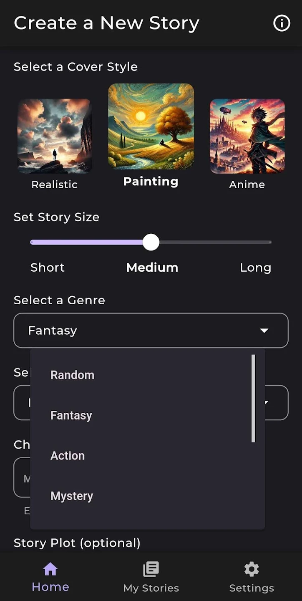
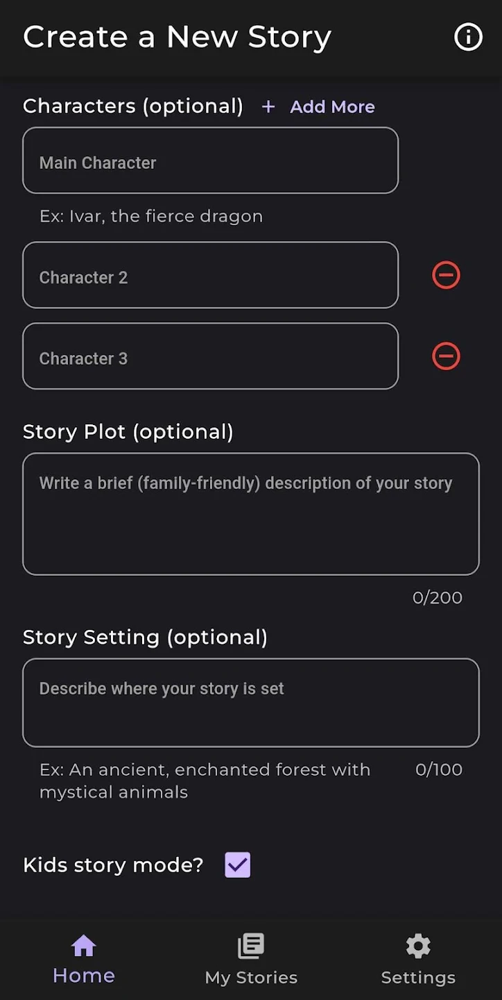
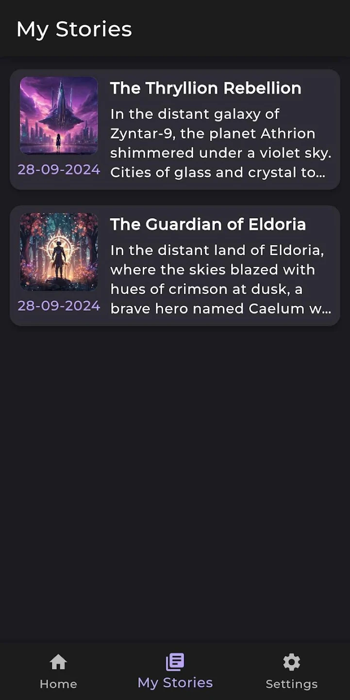
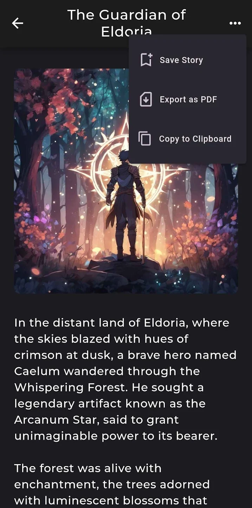
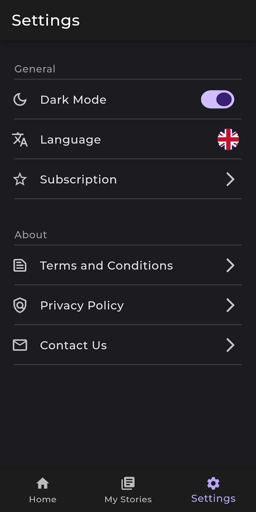

# 🖋️ InkFlow – AI Story & Image Generator

This repository is an **open version of the project** used to create the published app **InkFlow**, available on [Google Play](https://play.google.com/store/apps/details?id=com.blomstapps.inkflow). InkFlow is an Android application that combines **Large Language Models (LLMs)** and **text-to-image diffusion models** to generate creative stories and matching illustrations.

It is intended as a **portfolio and educational showcase**, demonstrating how Generative AI can be integrated into a modern mobile architecture built with Flutter.

## 🧩 Project Overview

InkFlow enables users to generate complete stories and matching illustrations through a guided, interactive process.
Instead of writing long prompts, users select genres, themes, tones, and characters, and optionally provide a short setting or plot idea.

The system orchestrates requests between a **Flutter mobile app**, a **Python FastAPI backend**, and external **AI services** for text and image generation.

### Key Objectives

* Demonstrate practical **LLM integration** in a mobile environment.
* Explore **Generative AI** and **Prompt Engineering**.
* Show how **text-to-image generation** can complement simple text generation.

### Components

| Layer            | Technology                          | Purpose                                                                    |
| ---------------- | ----------------------------------- | -------------------------------------------------------------------------- |
| **Frontend**     | Flutter                             | Android UI for user input and story visualization         |
| **Backend**      | FastAPI (Python)                    | Handles orchestration of AI APIs, data processing, prompt building and response formatting |
| **LLM API**      | Gemini (AI Studio)      | Generates narrative text from user input                                   |
| **Image API**    | Stability AI (DreamStudio) | Generates visual scenes and book-style illustrations                       |
| **Hosting**      | Fly.io                              | Dockerized backend deployment                                              |
| **Monetization** | Google AdMob         | Used mostly in the production app to monetize via ads                      |

## 🧠 AI Integration

### Text Generation

* **Model:** Gemini 2.0-flash-lite
* **Purpose:** Produce stories guided by user input with coherent structure and style
* **Integration:** Via Google AI Studio API (REST calls from the FastAPI backend)

### Image Generation

* **Model:** Stability AI Stable Diffusion XL (SDXL)
* **Purpose:** Create artistic or realistic images matching the narrative context
* **Integration:** Via Stability API using text prompts derived from the generated story

## 📸 App Screenshots

Below are screenshots showcasing some of the app’s interface and main features.

  
  
  
  
  

## 💡 Future Development Directions

* Story continuation and editing interface
* Cloud synchronization across devices
* Integrated text-to-speech narration
* Style-tuned diffusion pipelines for consistent illustration aesthetics

## 👥 About

- **Developer:** BlomstApps (Pedro Arruda)
- **Focus Areas:** Generative AI, mobile systems, and human-AI creative interaction
- **Technologies:** Flutter, Python/FastAPI, Google AI, Stability AI, Fly.io

InkFlow was designed as an exploration of how **LLMs** and **diffusion models** can support creative expression on mobile platforms.

---

